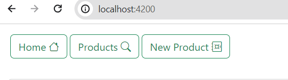
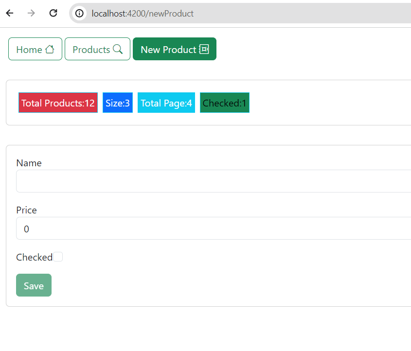
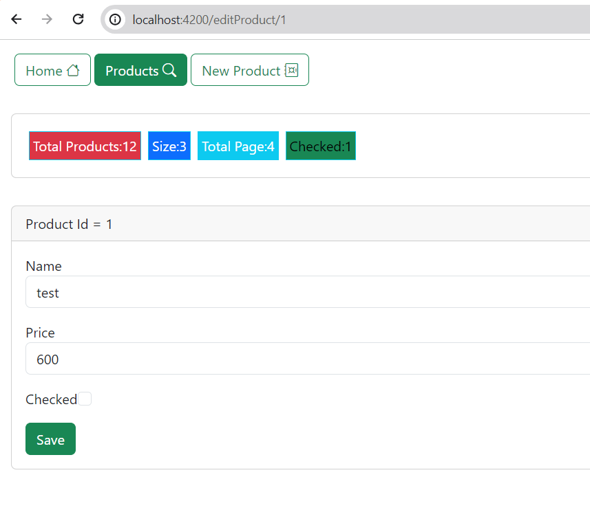

  <h2> Angular frameword  </h2>
<h3> Login :  </h3>
  
<h3> Incorrect password :  </h3>
  
  <h3> Navbar admin :  </h3>
  
   <h3> Navbar :  </h3>
  

   <h3> Liste des produits :  </h3>
  

<h3> Ajouter un produit :  </h3>
  

<h3> Modifier un produit :  </h3>
  

